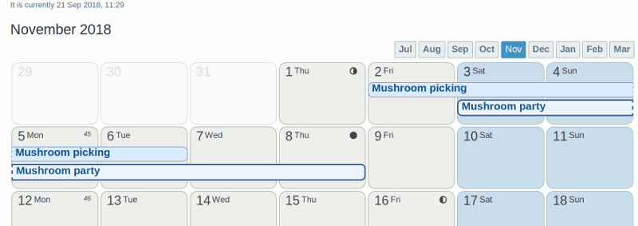

# phpBB Extension - marttiphpbb Calendar Month View

This phpBB extension provides a Calendar Month View page for the [Calendar extension set](https://github.com/marttiphpbb/phpbb-ext-calendarmono)

## Screenshot

## Requirements

* phpBB 3.2.1
* PHP 7.1+
* PHP calendar extension (PHP compiled with --enable-calendar)

## Quick Install

You can install this on the latest release of phpBB 3.2 by following the steps below:

* Create `marttiphpbb/calendarmonthview` in the `ext` directory.
* Download and unpack the repository into `ext/marttiphpbb/calendarmonthview`
* Enable `Calendar Month View` in the ACP at `Customise -> Manage extensions`.

## Uninstall

* Disable `Calendar Month View` in the ACP at `Customise -> Extension Management -> Extensions`.
* To permanently uninstall, click `Delete Data`. Optionally delete the `/ext/marttiphpbb/calendarmonthview` directory.

## Support

* Report bugs and other issues to the [Issue Tracker](https://github.com/marttiphpbb/phpbb-ext-calendarmonthview/issues).

## License

[GPL-2.0](license.txt)
